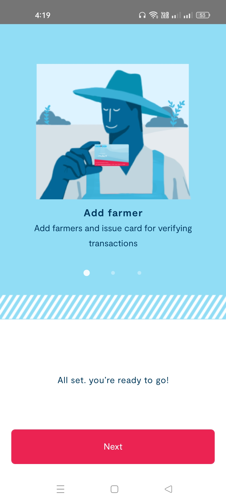
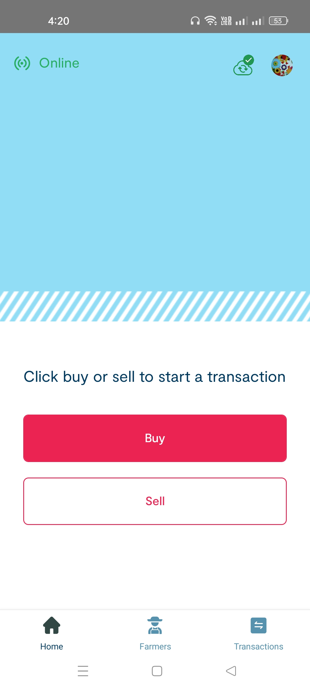
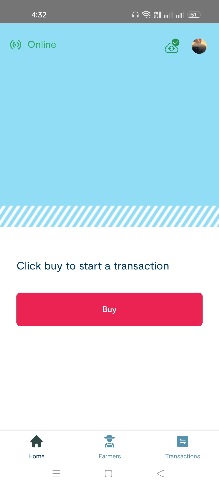
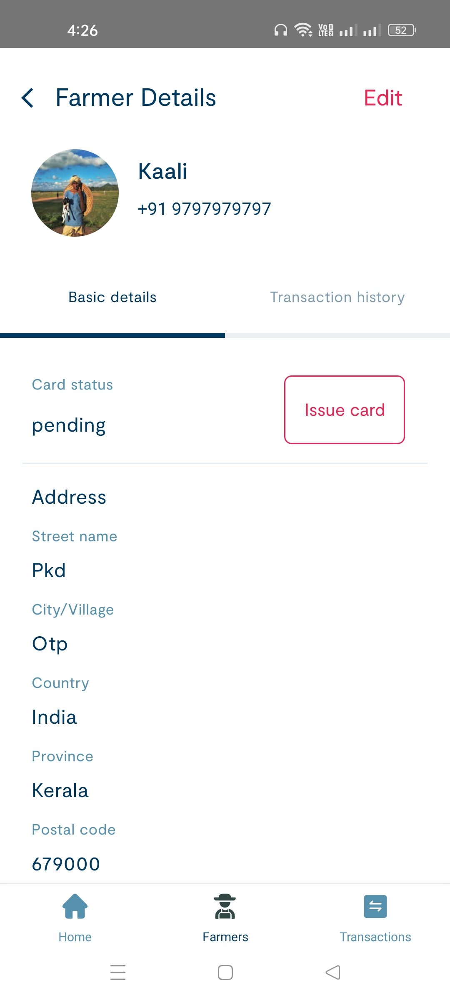
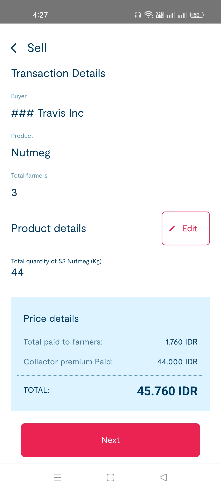
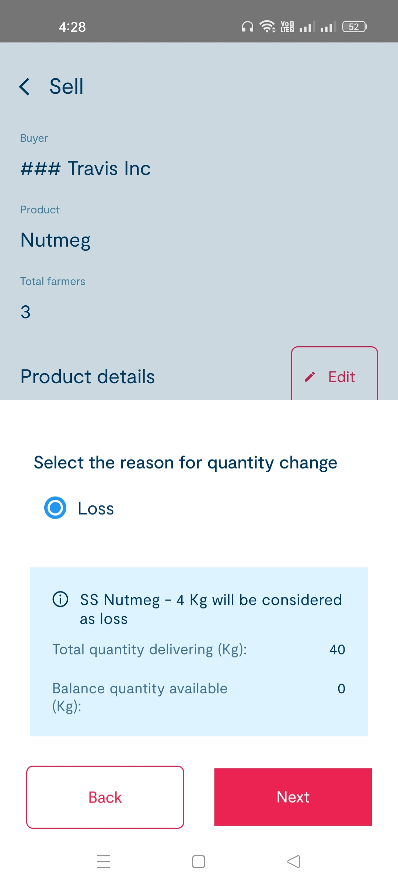
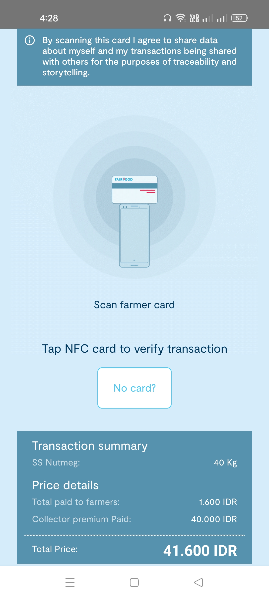

## Harvest mobile application

The brand can offer premium or special prices to the farmers in their supply chain. We are trying to enable a secure legitimate way for these brands to reach the end farmers in the supply chain and distribute the premium to them. The farmers do not have a direct connection with the brands and they are connected to the brand through the processors and suppliers in the supply chain. The farmer will supply their commodities to the collector who can be a processor or just a supplier in the chain. Most of these farmers will have limited internet connectivity and we can not assume all of them can manage their transactions and stock via the web or mobile platforms. Since the brand can not reach them directly we have to distribute the premium via the first entity in contact with the farmer which is the collector. 
The application can do 3 major functionalities, add new farmers to the platform, transfer stock, and verify the premium transaction.  The user should able to do these functionalities without the internet and able to sync them with the server when they are connected to the network. The user will add farmer information using the mobile app (offline and online). The farmer is then later verified by the external verifier and supplied with an NFC or RF ID enabled identity card. This card can be used as a way to verify the identity of the farmer. Harvest mobile application accomplished with React Native and React ecosystem, just a single code base for both android and ios.

## Documentation and more details
You can find the more details and Documentation about the application in the [Confluence page](https://rightorigins.atlassian.net/l/cp/AUj5ae1t)

### Installation

You must install all the react native requirements before installing this project.
React native installation guide can be found [here](https://reactnative.dev/docs/environment-setup).

Also need to install yarn package manager.

```
1. git clone git@git.cied.in:fairfood/trace-v2/frontend-mobile/fairfood-react-native.git
2. cd fairfood-react-native
3. yarn install
4. npx react-native link
```

### Running the project

You can follow the steps from [DEV_DOCS](DEV_DOCS.md) for running the project.

### Main dependencies

- [react](https://github.com/facebook/react)
- [react-native](https://github.com/facebook/react-native)
- [@nozbe/watermelondb](https://github.com/Nozbe/WatermelonDB)
- [react-native-nfc-manager](https://github.com/revtel/react-native-nfc-manager)

All the other dependecies used in this project can be found in this [confluene page](https://fairfood.atlassian.net/wiki/spaces/FA/pages/22675457/Collector+app+packages)

### Available on the Play store

<a href='https://play.google.com/store/apps/details?id=com.fairfood_collector'></a>

### Preview

The collector can be a person or entity who will deal directly with the farmer
on the ground to collect the stock from the farmer and pay them the prices. 
This app act as a medium to which will enable the farmers to receive their 
premium and validate the information.

* One user per device
* Work completely offline without any internet

**One User per device:** This means we will force logout the user 
from the other devices when the user tries to log in to the new device.

Please make sure you have removed/uninstalled the previous version
from your phone before installing the new one.

The user will be directed to the home page when user credentials are
authenticated. Users can use the rest of the app online or offline and the app 
should somehow highlight the pending syncing status(Pending items 
should be synced) and the connection status (online or offline).


&nbsp;&nbsp;&nbsp;&nbsp;&nbsp;&nbsp;&nbsp;&nbsp;&nbsp;&nbsp;&nbsp;&nbsp;&nbsp;&nbsp;&nbsp;&nbsp;

<br>

There is two different users:

 1. **Mediator Suppliers**: This user buy the product from farmer and sell to the supplier company.
 2. **Direct Suppliers**: This user buy the product directly from farmers, so they have only buy button.

  
&nbsp;&nbsp;&nbsp;&nbsp;&nbsp;&nbsp;&nbsp;&nbsp;&nbsp;&nbsp;&nbsp;&nbsp;&nbsp;&nbsp;&nbsp;&nbsp;



User can navigate to the following sections from the home page

* Transactions
* Farmers
* User Profile

**_Farmer list_**: 
The users can see the list of all the farmers connected to the user’s 
entity and add a new farmer into the platform from this page.
and user can edit the farmer information and verify the pending 
verifications one by one.<br>

 
&nbsp;&nbsp;&nbsp;&nbsp;&nbsp;&nbsp;&nbsp;&nbsp;&nbsp;&nbsp;&nbsp;&nbsp;&nbsp;&nbsp;&nbsp;&nbsp;


When adding a new farmers, a NFC card is assigning also we should be able 
to skip the NFC card pairing from create page.<br>

 <br>

**_Transactions_**: <br>
**Buy Products:**
After input the transaction details total amount is generated with premium amount. 
premium data is based on quantity and percentage of product.
**There is 2 premium**: Kualitas premium and data premium. Next step is to
verify the premium with card. and complete transaction.

**Sell Product**:
All incoming quantity will be merged into a single batch.
The collector can send quantity in his wallet to the buyer and he doesn't
have to select the source batch. Source quantity will be deducted from the 
farmer incoming pool.<br>

 
&nbsp;&nbsp;&nbsp;&nbsp;&nbsp;&nbsp;&nbsp;&nbsp;&nbsp;&nbsp;&nbsp;&nbsp;&nbsp;&nbsp;&nbsp;&nbsp;
 <br>

Implement partial delivery / loss feature when sell a product. If I have 5Kg in
stock, and I sell 4Kg from
stock to the company then the 1Kg is treated as loss. 

**_Premium Verification_**:The application will show the verification page 
when the transaction details are confirmed. 
The farmer can tap his NFC card and verify. Users can also skip verification 
using the card. and upload a photo to verify 
farmer.



Transaction List Page:


&nbsp;&nbsp;&nbsp;&nbsp;&nbsp;&nbsp;&nbsp;&nbsp;&nbsp;&nbsp;&nbsp;&nbsp;&nbsp;&nbsp;&nbsp;&nbsp;

