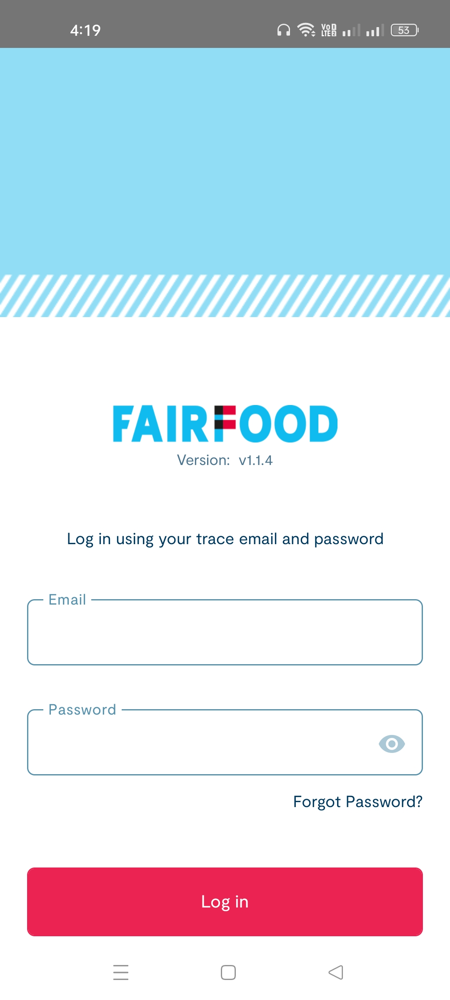
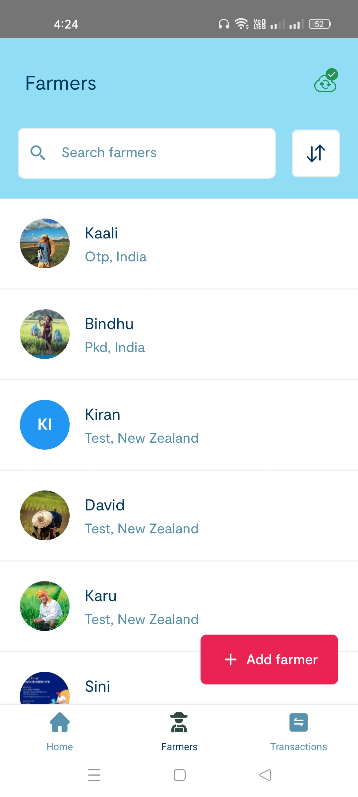
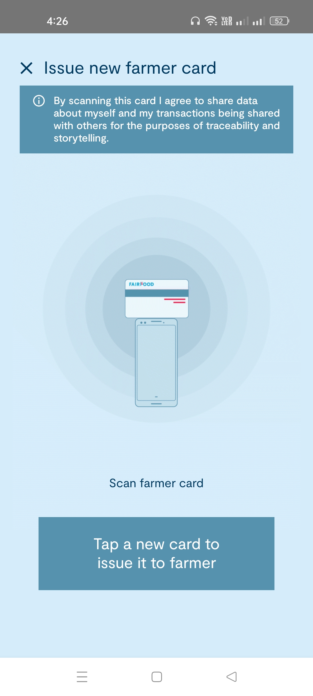
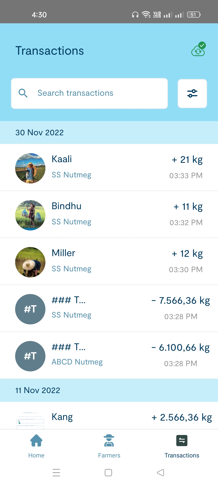

## Trace mobile App

Trace Mobile is a data collection app to support agriculture vaulue chians in with product traceability and provide evidence for payment or sustainability claims.  Importantly, it aims to include farmers in the data collection process and enable ways to reward them for their participation.

It does this through the colleciton of the following data:
  * Basic farmer registration information.
  * Product delivery information (e.g. quantity, price, quality).
  * Evidence collection (e.g. photos of delivery receipts, farmer NFC card scans).
  
Trace Mobile is designed to work in the field, meaning:
  1. Internet access may be very limited, slow, or infrequent.
  2. Data collection is not the primary task of farmers or those buying / receiving products from farmers, users may have limited tech experiance.
  3. Localization must be supported.
  4. Farmers may have little or no access to technoloby or the internet (smart phones, feature phones, email, etc).
  
The app therefore:
  * Is designed to be used by the individual who is buying or collecting products from the farmer (not the farmer themselves).
  * Minimized data entry and focuses on speed / ease of use of use for the user; this allows them to record information very quickly and move on with their work.
  * Allows data to be collected offline and infrequently synced when internet access is available.
  * Supports translations.
  * Does not require that the farmer have a phone, internect connection, or email address.
  * Allows farmers to participate in the value chain via the issuing and scanning NFC cards to verify deliveries and/or payment, or via photos of signed delivery receipts or other documentation.
  
Trace is developed by Fairfood International (fairfood.org) which is piloting the use of this tool in Indoenesia and Sierra Leone.  Read more about [these projects here][resources]

Powered by: [React Native][react_native_setup] and [React][react]


## Documentation
You can find the more details and Documentation about the application in the [Confluence page][documentation]


## Quick start

You must install all the react native requirements before installing this project.
React native installation guide can be found [here][react_native_setup].

Also need to install yarn package manager.

```
1. git clone https://github.com/Fairfood/trace-app.git .
2. cd trace-app
3. yarn install
4. npx react-native link
```

### Running the project

You can follow the steps from [DEV_DOCS](DEV_DOCS.md) for running the project.

### Main dependencies

- [react](https://github.com/facebook/react)
- [react-native](https://github.com/facebook/react-native)
- [@nozbe/watermelondb](https://github.com/Nozbe/WatermelonDB)
- [react-native-nfc-manager](https://github.com/revtel/react-native-nfc-manager)

All the other dependecies used in this project can be found in this [confluene page][packages]


## Available on the Play store

<a href='https://play.google.com/store/apps/details?id=com.fairfood_collector'></a>


### Preview


&nbsp;&nbsp;&nbsp;&nbsp;&nbsp;&nbsp;&nbsp;&nbsp;&nbsp;&nbsp;&nbsp;&nbsp;&nbsp;&nbsp;&nbsp;&nbsp;

 
&nbsp;&nbsp;&nbsp;&nbsp;&nbsp;&nbsp;&nbsp;&nbsp;&nbsp;&nbsp;&nbsp;&nbsp;&nbsp;&nbsp;&nbsp;&nbsp;


&nbsp;&nbsp;&nbsp;&nbsp;&nbsp;&nbsp;&nbsp;&nbsp;&nbsp;&nbsp;&nbsp;&nbsp;&nbsp;&nbsp;&nbsp;&nbsp;


&nbsp;&nbsp;&nbsp;&nbsp;&nbsp;&nbsp;&nbsp;&nbsp;&nbsp;&nbsp;&nbsp;&nbsp;&nbsp;&nbsp;&nbsp;&nbsp;
<br>


## How to use app

If you want to know how Trace mobile app works, you can follow the doc [here][how_it_works].


## About us


&nbsp;&nbsp;&nbsp;&nbsp;&nbsp;&nbsp;&nbsp;&nbsp;&nbsp;&nbsp;&nbsp;&nbsp;&nbsp;&nbsp;&nbsp;&nbsp;
<br><br>

[Fairfood][fairfood] accelerates the change towards a sustainable food system. We develop innovative solutions that enable businesses to improve their responsible business practices. Open and attainable solutions that are designed to democratise the world of food.

## Security Policy

### Reporting a Vulnerability
Please report (suspected) security vulnerabilities to
**[sudeesh@fairfood.org](mailto:sudeesh@fairfood.org)**. You will receive a response from
us within 48 hours. If the issue is confirmed, we will release a patch as soon
as possible depending on complexity but historically within a few days.


[documentation]: https://fairfood.atlassian.net/l/cp/4B832Mzw
[react_native_setup]: https://reactnative.dev/docs/environment-setup
[packages]: https://fairfood.atlassian.net/l/cp/UHK9UBx0
[how_it_works]: https://fairfood.atlassian.net/wiki/spaces/THD/pages/24543453/Help+Centre
[fairfood]: https://fairfood.org/
[resources]: https://fairfood.org/en/resources/fairfood-farmer-cards-trace-transactions/
[react]: https://reactjs.org/
